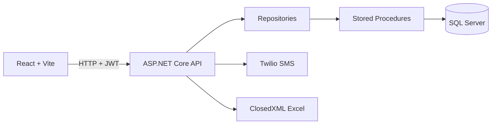

# ZYX Logística

Sistema web desenvolvido para simular uma operação logística da empresa fictícia ZYX Logística, com foco em agendamento de cargas, controle operacional, inventário, check-in de motoristas e relatórios digitais.

> Projeto criado para fins técnicos. Dados, usuários, telefones e operações utilizados na demonstração são fictícios.

## Objetivo

A proposta é resolver gargalos comuns em operações logísticas:

- Falta de controle sobre recebimento e expedição de cargas.
- Ausência de rastreabilidade dos agendamentos e mudanças de status.
- Controle manual de entrada e saída de estoque.
- Check-in sem registro eletrônico.
- Falta de relatórios consolidados para tomada de decisão.

## Stack

| Camada | Tecnologias |
| --- | --- |
| Frontend | React, Vite, TypeScript, Font Awesome |
| Backend | .NET 8, ASP.NET Core Web API, JWT, User Secrets |
| Banco | SQL Server, Stored Procedures |
| Relatórios | ClosedXML, Excel `.xlsx` |
| SMS | Twilio ou provedor simulado |

## Funcionalidades

- Login com JWT.
- Primeiro acesso com definição de senha.
- Controle de perfis e permissões por tela/ação.
- Menu dinâmico conforme permissões do perfil.
- Cadastros de transportadora, motorista, veículo, local/doca, produto, usuário e perfil.
- Agendamentos inbound e outbound.
- Visualização de agenda em janela de 7 dias a partir da data selecionada.
- Validação de disponibilidade por horário e quantidade de locais/docas.
- Check-in por CNH com código de 6 dígitos via SMS.
- Tela de check-in simulando um totem/tablet fixo na recepção do CD.
- Fluxo operacional separado por status: Check-in realizado, Em doca e Finalizado.
- Movimentação de itens da operação com reflexo no inventário.
- Bloqueio de expedição outbound quando não há estoque suficiente.
- Relatórios em Excel.

## Arquitetura



### Backend

O backend está em `backend/ZyxLogistics.Api`.

Principais camadas:

- `Controllers`: recebem as requisições HTTP e aplicam as policies de permissão.
- `DTOs`: definem os contratos de entrada e saída da API.
- `Repositories`: executam as procedures no SQL Server.
- `Models`: representam os dados retornados do banco.
- `Services`: autenticação, token, senha e envio de SMS.
- `Security`: validação de permissões via JWT.
- `Scripts`: script base do banco.

### Frontend

O frontend está em `frontend`.

Principais pontos:

- `layouts/MainLayout`: menu lateral, cabeçalho e logout.
- `pages/Login`: login e primeiro acesso.
- `pages/Cadastros`: telas reutilizadas de cadastro.
- `pages/Agendamentos`: agenda inbound/outbound.
- `pages/Operacoes`: fluxo operacional inbound/outbound.
- `pages/CheckIn`: tela em formato de tablet, simulando um totem de autoatendimento na recepção do CD.
- `pages/Relatorios`: exportação de relatórios em Excel.
- `security/permissions.ts`: regras de visibilidade conforme permissões.

## Banco de dados

Existem duas formas de preparar o banco.

### Opção 1: Restaurar backup

O projeto possui um backup em:

```text
banco/zyx_banco.bak
```

Esse caminho foi mantido para facilitar a avaliação e permitir restaurar o ambiente com dados de demonstração.

### Opção 2: Criar pelo script

Também existe o script completo em:

```text
backend/ZyxLogistics.Api/Scripts/001_base_database.sql
```

Ele cria as tabelas, relacionamentos, permissões, perfis base, usuário administrador inicial e stored procedures.

Perfis base:

- `Administrador`
- `Operador`
- `Consulta`

Usuário inicial:

```text
Email: admin@zyx.local
Senha: definida pelo fluxo de primeiro acesso
```

Ao entrar pela primeira vez, use o link de primeiro acesso da tela de login para definir a senha do administrador.

## Configuração da API

Entre na pasta da API:

```bash
cd backend/ZyxLogistics.Api
```

Configure a connection string conforme seu SQL Server:

```bash
dotnet user-secrets set "ConnectionStrings:DefaultConnection" "Server=SEU_SERVIDOR;Database=ZyxLogisticsDb;Trusted_Connection=True;TrustServerCertificate=True;"
```

Configure uma chave JWT para desenvolvimento:

```bash
dotnet user-secrets set "Jwt:Key" "uma-chave-grande-para-desenvolvimento"
```

Rode a API:

```bash
dotnet run
```

Por padrão, a API roda em:

```text
http://localhost:5271
```

## Configuração do SMS

O sistema suporta dois modos de SMS.

### SMS simulado

Use quando quiser testar o fluxo sem gastar crédito ou depender de telefone real.

```bash
dotnet user-secrets set "Sms:Provider" "Simulated"
```

Nesse modo, o frontend mostra um aviso discreto com o código de teste na tela de confirmação do check-in.

### SMS real com Twilio

Use quando quiser enviar SMS real para o celular do motorista.

```bash
dotnet user-secrets set "Sms:Provider" "Twilio"
dotnet user-secrets set "Sms:Twilio:AccountSid" "SEU_ACCOUNT_SID"
dotnet user-secrets set "Sms:Twilio:AuthToken" "SEU_AUTH_TOKEN"
dotnet user-secrets set "Sms:Twilio:From" "+NUMERO_TWILIO"
```

Observações:

- Em conta trial da Twilio, normalmente só é possível enviar para números verificados.
- Nunca versionar `AccountSid`, `AuthToken` ou qualquer segredo real.
- O `appsettings.json` mantém os campos vazios; dados sensíveis devem ficar em user-secrets.

## Configuração do frontend

Entre na pasta do frontend:

```bash
cd frontend
```

Instale as dependências:

```bash
npm install
```

Rode o projeto:

```bash
npm run dev
```

O Vite normalmente abre em:

```text
http://localhost:5173
```

Caso a porta esteja ocupada, ele pode usar outra porta, como `5174`.

## Fluxo principal da aplicação

1. Administrador faz primeiro acesso e define senha.
2. Administrador cria perfis e marca permissões por checkbox.
3. Administrador cria usuários e vincula cada um a um perfil.
4. Cadastros base são preenchidos: transportadoras, motoristas, veículos, locais/docas e produtos.
5. Usuário cria agendamento inbound ou outbound.
6. Motorista faz check-in pela tela `/checkin`, informando CNH e código SMS.
7. A tela `/checkin` representa um totem/tablet na recepção do CD, onde o próprio motorista realiza a identificação antes de iniciar a operação.
8. Operação visualiza agendas com check-in realizado.
9. Usuário envia a agenda para doca, informando o local.
10. Usuário adiciona itens da operação.
11. Sistema movimenta o inventário conforme inbound ou outbound.
12. Operação é finalizada.
13. Relatórios podem ser exportados em Excel.

## Regras de negócio implementadas

### Agendamentos

- A agenda sempre pertence a uma operação: `Inbound` ou `Outbound`.
- A tela lista 7 dias a partir da data selecionada.
- Agendamentos são ordenados por horário.
- Ao criar agenda, o status inicial é `Agendado`.
- Agenda cancelada ou finalizada não deve ser editada como agenda ativa.
- Agenda finalizada não pode ser cancelada.
- Motorista com agendamento ativo não deve ser usado em outro agendamento ativo.
- Veículos são filtrados pela transportadora selecionada.
- Horários disponíveis consideram a janela de agendamento e a quantidade de locais/docas cadastrados.

### Check-in

- A tela foi desenhada para simular um totem/tablet fixo na recepção do CD.
- Motorista informa a CNH.
- Sistema busca o agendamento ativo mais próximo daquele motorista.
- Sistema gera código de 6 dígitos.
- Código pode ser enviado por Twilio ou exibido em modo simulado.
- Confirmação muda o status para `CheckInRealizado`.

### Operação

- Operações inbound e outbound são separadas.
- A tela operacional trabalha por abas de status:
  - Check-in realizado.
  - Em doca.
  - Finalizado.
- Para enviar para doca, é necessário escolher um local.
- Um local em uso por agenda `EmDoca` não pode ser usado por outra agenda simultaneamente.
- Para finalizar, é obrigatório ter ao menos um item na operação.

### Inventário

- Ao cadastrar produto, o inventário inicia com quantidade zero.
- Inbound soma quantidade ao estoque.
- Outbound subtrai quantidade do estoque.
- Outbound bloqueia movimentação quando não há estoque suficiente.

### Permissões

- Permissões são gravadas no banco.
- O JWT carrega as permissões do usuário.
- O frontend esconde menus, rotas e botões não autorizados.
- O backend também bloqueia endpoints por policy.
- Menu pai só aparece se o usuário possuir pelo menos uma opção filha liberada.

## Relatórios

Todos os relatórios são exportados em Excel:

- Agendamentos geral.
- Estoque atual.
- Agendas finalizadas.
- Movimentação de estoque.
- Cargas recebidas e enviadas.
- Performance operacional.

Os filtros principais são período, operação e tipo de relatório.

## Evidências visuais

Adicione os prints reais em `docs/images`. A tabela abaixo já aponta para os arquivos esperados.

| Tela | Arquivo |
| --- | --- |
| Login | [docs/images/01-login.png](docs/images/01-login.png) |
| Primeiro acesso | [docs/images/02-primeiro-acesso.png](docs/images/02-primeiro-acesso.png) |
| Menu com permissões | [docs/images/03-menu-permissoes.png](docs/images/03-menu-permissoes.png) |
| Agendamentos inbound | [docs/images/04-agendamentos-inbound.png](docs/images/04-agendamentos-inbound.png) |
| Operação inbound | [docs/images/05-operacao-inbound.png](docs/images/05-operacao-inbound.png) |
| Modal de itens | [docs/images/06-itens-operacao.png](docs/images/06-itens-operacao.png) |
| Check-in totem/tablet | [docs/images/07-checkin.png](docs/images/07-checkin.png) |
| Check-in código | [docs/images/08-checkin-codigo.png](docs/images/08-checkin-codigo.png) |
| Inventário | [docs/images/09-inventario.png](docs/images/09-inventario.png) |
| Relatórios | [docs/images/10-relatorios.png](docs/images/10-relatorios.png) |

## Scripts úteis

Backend:

```bash
cd backend/ZyxLogistics.Api
dotnet build
dotnet run
```

Frontend:

```bash
cd frontend
npm install
npm run dev
npm run build
```

## Estrutura do repositório

```text
xyzlogistica/
|-- backend/
|   `-- ZyxLogistics.Api/
|       |-- Controllers/
|       |-- DTOs/
|       |-- Models/
|       |-- Repositories/
|       |-- Scripts/
|       |-- Security/
|       `-- Services/
|-- banco/
|   `-- zyx_banco.bak
|-- docs/
|   `-- images/
`-- frontend/
    |-- images/
    `-- src/
        |-- layouts/
        |-- pages/
        `-- security/
```

## Observações

- A solução simula um ambiente real de operação logística.
- O controle de acesso é aplicado no frontend e no backend.
- O banco utiliza stored procedures para manter a regra operacional centralizada.
- O sistema permite testar SMS real via Twilio ou fluxo local com SMS simulado.
- O backup `.bak` facilita restaurar o ambiente rapidamente.
- O script SQL permite recriar o banco do zero caso o usuário prefira.
