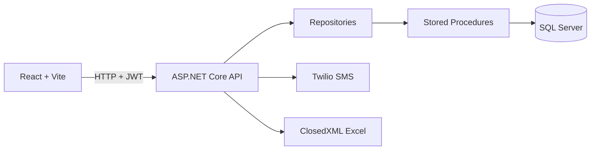

# ZYX Logistics MVP

Sistema web desenvolvido para simular uma operacao logistica da empresa ficticia ZYX Logistica, com foco em agendamento de cargas, controle operacional, inventario, check-in de motoristas e relatorios digitais.

> Projeto criado para fins tecnicos. Dados, usuários, telefones e operações utilizados na demonstração são fícticios.

## Objetivo

A proposta é resolver gargalos comuns em operaçõees logísticas:

- Falta de controle sobre recebimento e expedicao de cargas.
- Ausencia de rastreabilidade dos agendamentos e mudancas de status.
- Controle manual de entrada e saida de estoque.
- Check-in sem registro eletronico.
- Falta de relatorios consolidados para tomada de decisao.

## Stack

| Camada | Tecnologias |
| --- | --- |
| Frontend | React, Vite, TypeScript, Font Awesome |
| Backend | .NET 8, ASP.NET Core Web API, JWT, User Secrets |
| Banco | SQL Server, Stored Procedures |
| Relatorios | ClosedXML, Excel `.xlsx` |
| SMS | Twilio ou provedor simulado |

## Funcionalidades

- Login com JWT.
- Primeiro acesso com definição de senha.
- Controle de perfis e permissoes por tela/acao.
- Menu dinamico conforme permissões do perfil.
- Cadastros de transportadora, motorista, veículo, local/doca, produto, usuário e perfil.
- Agendamentos inbound e outbound.
- Visualizacao de agenda em janela de 7 dias a partir da data selecionada.
- Validacao de disponibilidade por horario e quantidade de locais/docas.
- Check-in por CNH com codigo de 6 digitos via SMS.
- Fluxo operacional separado por status: Check-in realizado, Em doca e Finalizado.
- Movimentacao de itens da operacao com reflexo no inventario.
- Bloqueio de expedicao outbound quando nao há estoque suficiente.
- Relatórios em Excel.

## Arquitetura



### Backend

O backend esta em `backend/ZyxLogistics.Api`.

Principais camadas:

- `Controllers`: recebem as requisicoes HTTP e aplicam as policies de permissao.
- `DTOs`: definem os contratos de entrada e saida da API.
- `Repositories`: executam as procedures no SQL Server.
- `Models`: representam os dados retornados do banco.
- `Services`: autenticacao, token, senha e envio de SMS.
- `Security`: validacao de permissoes via JWT.
- `Scripts`: script base do banco.

### Frontend

O frontend esta em `frontend`.

Principais pontos:

- `layouts/MainLayout`: menu lateral, cabecalho e logout.
- `pages/Login`: login e primeiro acesso.
- `pages/Cadastros`: telas reutilizadas de cadastro.
- `pages/Agendamentos`: agenda inbound/outbound.
- `pages/Operacoes`: fluxo operacional inbound/outbound.
- `pages/CheckIn`: tela estilo tablet para check-in do motorista.
- `pages/Relatorios`: exportacao de relatorios em Excel.
- `security/permissions.ts`: regras de visibilidade conforme permissoes.

## Banco de dados

Existem duas formas de preparar o banco.

### Opcao 1: Restaurar backup

O projeto possui um backup em:

```text
banco/zyx_banco.bak
```

Esse caminho foi mantido para facilitar a avaliacao e permitir restaurar o ambiente com dados de demonstracao.

### Opcao 2: Criar pelo script

Tambem existe o script completo em:

```text
backend/ZyxLogistics.Api/Scripts/001_base_database.sql
```

Ele cria as tabelas, relacionamentos, permissoes, perfis base, usuario administrador inicial e stored procedures.

Perfis base:

- `Administrador`
- `Operador`
- `Consulta`

Usuario inicial:

```text
Email: admin@zyx.local
Senha: definida pelo fluxo de primeiro acesso
```

Ao entrar pela primeira vez, use o link de primeiro acesso da tela de login para definir a senha do administrador.

## Configuracao da API

Entre na pasta da API:

```bash
cd backend/ZyxLogistics.Api
```

Configure a connection string conforme seu SQL Server:

```bash
dotnet user-secrets set "ConnectionStrings:DefaultConnection" "Server=SEU_SERVIDOR;Database=ZyxLogisticsDb;Trusted_Connection=True;TrustServerCertificate=True;"
```

Configure uma chave JWT para desenvolvimento:

```bash
dotnet user-secrets set "Jwt:Key" "uma-chave-grande-para-desenvolvimento"
```

Rodar a API:

```bash
dotnet run
```

Por padrao, a API roda em:

```text
http://localhost:5271
```

## Configuracao do SMS

O sistema suporta dois modos de SMS.

### SMS simulado

Use quando quiser testar o fluxo sem gastar credito ou depender de telefone real.

```bash
dotnet user-secrets set "Sms:Provider" "Simulated"
```

Nesse modo, o frontend mostra um aviso discreto com o codigo de teste na tela de confirmacao do check-in.

### SMS real com Twilio

Use quando quiser enviar SMS real para o celular do motorista.

```bash
dotnet user-secrets set "Sms:Provider" "Twilio"
dotnet user-secrets set "Sms:Twilio:AccountSid" "SEU_ACCOUNT_SID"
dotnet user-secrets set "Sms:Twilio:AuthToken" "SEU_AUTH_TOKEN"
dotnet user-secrets set "Sms:Twilio:From" "+NUMERO_TWILIO"
```

Observacoes:

- Em conta trial da Twilio, normalmente só é possivel enviar para números verificados.
- Nunca versionar `AccountSid`, `AuthToken` ou qualquer segredo real.
- O `appsettings.json` mantem os campos vazios; dados sensiveis devem ficar em user-secrets.

## Configuracao do frontend

Entre na pasta do frontend:

```bash
cd frontend
```

Instale as dependencias:

```bash
npm install
```

Rode o projeto:

```bash
npm run dev
```

O Vite normalmente abre em:

```text
http://localhost:5173
```

Caso a porta esteja ocupada, ele pode usar outra porta, como `5174`.

## Fluxo principal da aplicacao

1. Administrador faz primeiro acesso e define senha.
2. Administrador cria perfis e marca permissoes por checkbox.
3. Administrador cria usuarios e vincula cada um a um perfil.
4. Cadastros base sao preenchidos: transportadoras, motoristas, veiculos, locais/docas e produtos.
5. Usuario cria agendamento inbound ou outbound.
6. Motorista faz check-in pela tela `/checkin`, informando CNH e codigo SMS.
7. Operacao visualiza agendas com check-in realizado.
8. Usuario envia a agenda para doca, informando o local.
9. Usuario adiciona itens da operacao.
10. Sistema movimenta o inventario conforme inbound ou outbound.
11. Operacao e finalizada.
12. Relatorios podem ser exportados em Excel.

## Regras de negocio implementadas

### Agendamentos

- A agenda sempre pertence a uma operação: `Inbound` ou `Outbound`.
- A tela lista 7 dias a partir da data selecionada.
- Agendamentos são ordenados por horário.
- Ao criar agenda, o status inicial e `Agendado`.
- Agenda cancelada ou finalizada nao deve ser editada como agenda ativa.
- Agenda finalizada não pode ser cancelada.
- Motorista com agendamento ativo não deve ser usado em outro agendamento ativo.
- Veículos são filtrados pela transportadora selecionada.
- Horarios disponiveis consideram a janela de agendamento e a quantidade de locais/docas cadastrados.

### Check-in

- Motorista informa a CNH.
- Sistema busca o agendamento ativo mais proximo daquele motorista.
- Sistema gera codigo de 6 digitos.
- Código pode ser enviado por Twilio ou exibido em modo simulado.
- Confirmacao muda o status para `CheckInRealizado`.

### Operação

- Operações inbound e outbound são separadas.
- A tela operacional trabalha por abas de status:
  - Check-in realizado.
  - Em doca.
  - Finalizado.
- Para enviar para doca, e necessario escolher um local.
- Um local em uso por agenda `EmDoca` não pode ser usado por outra agenda simultaneamente.
- Para finalizar, é obrigatório ter ao menos um item na operação.

### Inventário

- Ao cadastrar produto, o inventário inicia com quantidade zero.
- Inbound soma quantidade ao estoque.
- Outbound subtrai quantidade do estoque.
- Outbound bloqueia movimentacao quando nao ha estoque suficiente.

### Permissões

- Permissões são gravadas no banco.
- O JWT carrega as permissoes do usuario.
- O frontend esconde menus, rotas e botoes nao autorizados.
- O backend tambem bloqueia endpoints por policy.
- Menu pai so aparece se o usuario possuir pelo menos uma opcao filha liberada.

## Relatórios

Todos os relatórios são exportados em Excel:

- Agendamentos geral.
- Estoque atual.
- Agendas finalizadas.
- Movimentação de estoque.
- Cargas recebidas e enviadas.
- Performance operacional.

Os filtros principais são período, operação e tipo de relatório.

## Evidencias visuais


| Tela | Arquivo |
| --- | --- |
| Login | `docs/images/01-login.png` |
| Primeiro acesso | `docs/images/02-primeiro-acesso.png` |
| Menu com permissoes | `docs/images/03-menu-permissoes.png` |
| Agendamentos inbound | `docs/images/04-agendamentos-inbound.png` |
| Operacao inbound | `docs/images/05-operacao-inbound.png` |
| Modal de itens | `docs/images/06-itens-operacao.png` |
| Check-in tablet | `docs/images/07-checkin.png` |
| Check-in código | `docs/images/08-checkin-codigo.png` |
| Inventario | `docs/images/09-inventario.png` |
| Relatorios | `docs/images/10-relatorios.png` |


## Scripts úteis

Backend:

```bash
cd backend/ZyxLogistics.Api
dotnet build
dotnet run
```

Frontend:

```bash
cd frontend
npm install
npm run dev
npm run build
```

## Estrutura do repositorio

```text
xyzlogistica/
├── backend/
│   └── ZyxLogistics.Api/
│       ├── Controllers/
│       ├── DTOs/
│       ├── Models/
│       ├── Repositories/
│       ├── Scripts/
│       ├── Security/
│       └── Services/
├── banco/
│   └── zyx_banco.bak
├── docs/
│   └── images/
└── frontend/
    ├── images/
    └── src/
        ├── layouts/
        ├── pages/
        └── security/
```

## Observacoes

- A solucao simula um ambiente real de operação logística.
- O controle de acesso é aplicado no frontend e no backend.
- O banco utiliza stored procedures para manter a regra operacional centralizada.
- O sistema permite testar SMS real via Twilio ou fluxo local com SMS simulado.
- O backup `.bak` facilita restaurar o ambiente rapidamente.
- O script SQL permite recriar o banco do zero caso o usuário prefira.
